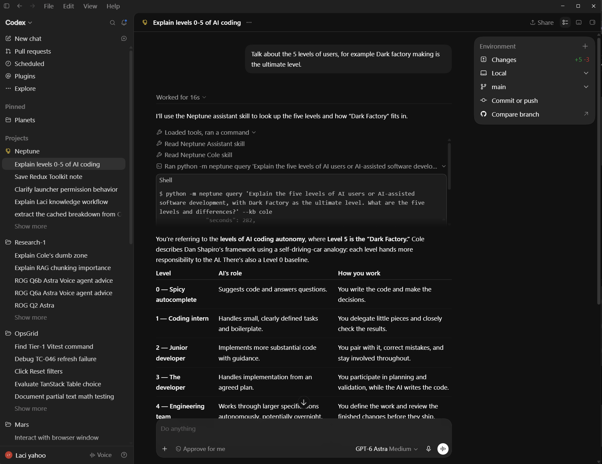

# Neptune

Neptune is a personal assistant operated by **Codex**, with two local knowledge
bases, notes, and flashcards. Codex is the runtime: no second agent
loop, model API wrapper, or background service.

Cole contains AI engineering knowledge. Laci holds your explicitly saved personal
knowledge, notes, and study cards. Ask naturally in a dedicated Neptune task.

## Why I built it

I wanted a personal knowledge system between what I can remember and everything
available online: a place for information I trust, which I can grow and query through
conversation. Neptune brings knowledge retrieval, note capture, and study into one
workflow, with Markdown records in the OKF format and explicit sources for answers.

## A question in practice

You do not need to remember a concept's exact name. In this example, I asked:

> Talk about the 5 levels of users, for example Dark factory making is the ultimate level.

Codex clarified the topic into a query about AI-assisted software development,
called Neptune's Cole retrieval tool, and used the returned evidence to explain
levels 0–5 with source links. The reformulation retained “five”; the evidence
supplied the Level 0 baseline as well.



The screenshot shows part of the response. The full answer follows; local source
links have been adapted for this repository. This example illustrates the workflow,
not a guarantee that every ambiguous question will be resolved correctly.

<details>
<summary>Read the full example answer</summary>

You’re referring to the **levels of AI coding autonomy**, where **Level 5 is the “Dark Factory.”** Cole describes Dan Shapiro’s framework using a self-driving-car analogy: each level hands more responsibility to the AI. There’s also a Level 0 baseline.

| Level | AI’s role | How you work |
|---|---|---|
| **0 — Spicy autocomplete** | Suggests code and answers questions. | You write the code and make the decisions. |
| **1 — Coding intern** | Handles small, clearly defined tasks and boilerplate. | You delegate little pieces and closely check the results. |
| **2 — Junior developer** | Implements more substantial code with guidance. | You pair with it, correct mistakes, and stay involved throughout. |
| **3 — The developer** | Handles implementation from an agreed plan. | You participate in planning and validation, while the AI writes the code. |
| **4 — Engineering team** | Works through larger specifications autonomously, potentially overnight. | You define the work and review the finished changes before they ship. |
| **5 — Dark Factory** | Plans, implements, validates, and ships without human review. | You define the mission, constraints, and acceptance criteria, and engineer the system that enforces them. |

This breakdown comes from Cole’s [source record, “Overview”](https://github.com/coleam00/cole-medin-knowledge-base/blob/eba5e31bc628280c546d4828491051c308d550dc/sources/the-best-ai-coding-setup-isnt-the-most-autonomous-one-heres-why.md) and [video explanation](https://www.youtube.com/watch?v=muwRbfuKbR4) (published 2026-07-03).

The biggest distinction between **Level 4 and Level 5 is who authorizes shipping**. At Level 4, an AI can work for hours independently, but a human still reviews its output. At Level 5, the system’s own validation decides whether the change reaches production.

A Dark Factory therefore needs much more than a powerful coding agent: clear operating rules, repeatable workflows, independent validation, deployment controls, and regression testing. In Cole’s experiment, a separate validation agent receives the user journey and code changes without the implementation conversation, helping it judge the result independently. See the [Dark Factory source record](https://github.com/coleam00/cole-medin-knowledge-base/blob/eba5e31bc628280c546d4828491051c308d550dc/sources/im-building-an-ai-dark-factory-that-ships-its-own-code-public-experiment.md) and [experiment video](https://www.youtube.com/watch?v=6woc6ii-zoE) (published 2026-04-15).

**“Ultimate” describes autonomy, rather than guaranteed quality.** Cole’s practical recommendation in the framework video is to establish a reliable Level 3 workflow before pushing higher. My interpretation is that the progression changes your job: you move from writing code, to directing implementation, to designing the system that decides whether the work is good enough to ship.

</details>

## How it works

1. **Interpret the request.** Codex uses the project skills to select Cole or Laci
   and formulate the tool call. Explicit knowledge-base choices take precedence.
2. **Retrieve evidence.** For Cole, the Tiger Python adapter searches a local SQLite
   FTS index and returns a bounded packet of canonical Markdown excerpts and source
   metadata. The retrieval code makes no model calls.
3. **Answer with sources.** Codex synthesizes the packet under instructions to use
   supported claims, cite records and videos, and acknowledge insufficient evidence.
   Video links use supplied timestamps when available.

Laci adds conversational saving, editing, notes, and flashcards. Its mutation tools
use revision checks and atomic file replacement; saved records remain readable Markdown.
See the [architecture](docs/ARCHITECTURE.md) for boundaries and implementation details.

## What I designed and evaluated

I defined the user workflows, architected the Tiger retrieval approach, and used
coding agents to implement it. I reviewed code and documentation throughout, ran
practical tests, and developed token-accounting scripts to compare approaches.

Earlier prototypes explored separate runtime LLMs, local and hosted models, Pi,
and n8n. Those experiments helped me choose Codex as the conversational runtime
and keep retrieval and persistence in deterministic tools. User experience also
shaped capture: I preferred flexible conversation over a document interview with
repeated item approvals and a final batch-save step.

In my **five-question comparison**, Neptune used **59.6K reported tokens versus
83.4K for direct Codex knowledge-base access: approximately 28.5% fewer**. The
comparison used the same reported model/effort setting. These are results for that
workload, calculated from rounded usage totals; see the
[token-efficiency report](docs/TOKEN-EFFICIENCY-REPORT.md) for questions and accounting.

Quality was evaluated separately. The [validation record](docs/VALIDATION.md)
documents deterministic tests and two fresh runtime examples: a supported answer
with timestamped provenance and an unsupported question answered with an explicit
evidence limitation. Those observations do not establish general answer reliability.

### Explore the implementation

| Area | Code or instructions |
|---|---|
| Bounded retrieval and provenance | [Tiger adapter](tiger/core.py) |
| Routing and conversational behavior | [Assistant skill](.agents/skills/neptune-assistant/SKILL.md) |
| Evidence and citation rules | [Cole skill](.agents/skills/neptune-cole/SKILL.md) |
| Record persistence and revision checks | [Record store](neptune/store.py) |
| Retrieval regression checks | [Tiger tests](tests/test_tiger.py) |

## Current scope

Neptune is a personal project, operated locally through Codex. Cole retrieval uses
lexical search, so relevance and evidence coverage have limits. Instructions guide
answer grounding; they do not make hallucinations impossible. The CLI launcher's
tested permission boundary is distinct from a desktop task's selected permissions.
There is no hosted service or mobile synchronization. Setup needs access to both
knowledge submodules. Availability of the personal Laci knowledge base may change;
if it becomes private, cloning it will require access. Cole's content is maintained
by its upstream author.

## Start

Requirements: Python 3.11+ with SQLite FTS5, an installed/authenticated Codex CLI,
and both knowledge submodules checked out. The tools use Python's standard library
only. This build was checked with Python 3.13.1 and Codex CLI 0.153.1.

Clone Neptune with both knowledge bases, then enter the project directory:

```powershell
git clone --recurse-submodules https://github.com/szlaci3/neptune.git
cd neptune
```

If you already cloned Neptune without its submodules, run this from the project directory:

```powershell
git submodule update --init --recursive
```

Then build the indexes and start Neptune:

```powershell
python -X utf8 -m neptune setup
python -X utf8 -m neptune start
```

The launcher checks PATH, then the Windows Codex desktop installation. You do not
need to modify PATH when using that installation. To select a specific executable,
use `python -m neptune start --codex 'C:/path/to/codex.exe'` or set
`NEPTUNE_CODEX_PATH`. Use `start --show-command` to inspect discovery without starting
a model session.

`setup` builds disposable search indexes without model calls or sample personal data.
`start` opens native interactive Codex with Neptune's skill and permission profile.
It inherits your model choice and authentication. Writes are limited to runtime
working space, Laci, and generated data; Cole and code remain read-only. Shell network
access and web search are disabled. Codex handles its own model communication.
The launcher also disables the inherited `node_repl` MCP server for this session;
Neptune's Python tools do not require it. Your global Codex configuration is unchanged.

In the Codex desktop app, open Neptune and start a fresh task with “Operate as Neptune
using the neptune-assistant skill.” Access is controlled by the desktop app's chosen permissions. The
CLI launcher's enforced profile is not automatically applied to desktop tasks. Use
the CLI launcher when you need the tested write boundary.

## Try it

- “Ask Cole: What does Cole mean by the dumb zone?”
- “Ask Laci: What do you know about my cycling?”
- “Save a note: JavaScript accepts 4_000 as the number 4000.”
- “Edit that note to explain why separators help readability.”
- “Promote that note into knowledge.”
- “Make a flashcard about this in my JavaScript deck.”
- “Quiz me on my due JavaScript cards.”

Author, Date, and Context are optional. Saves require your command or approval;
ambiguous edits require identifying the intended record. Edits preserve record paths,
and stale revisions are rejected. Notes are searchable Laci records, archive hides
them without deletion, and promotion changes type in place. Flashcards have named
decks and a transparent daily review schedule, stored locally.

## Tools and verification

```powershell
python -m neptune --help
python -m neptune query 'Ask Cole: Why does chunking matter in RAG?'
python -m neptune search --kind note
python -m neptune due --deck JavaScript
python -m unittest discover -s tests -v
python scripts/verify_runtime_sandbox.py
```

Run the last command from the host, not inside another restricted Windows token.
It checks actual access without writing Cole or application-code bytes.

See [architecture](docs/ARCHITECTURE.md), [validation](docs/VALIDATION.md), the
[record workflow](.agents/skills/neptune-assistant/references/records.md), and the
[Laci schema](knowledge/laci-knowledge-base/SCHEMA.md). The
[token-efficiency report](docs/TOKEN-EFFICIENCY-REPORT.md) records the user's five-question
usage comparison, startup figures, and limits of the available measurements.
